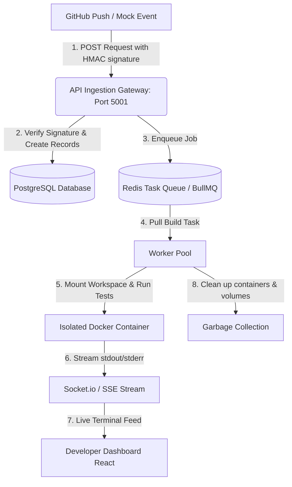

# Git-Triggered Headless CI/CD Automation Engine

A high-performance, event-driven infrastructure designed to simulate the core code orchestration and build processing pipelines of platforms like Vercel, Netlify, and GitHub Actions. This project validates advanced architectural concepts in distributed systems, cryptographic event verification, task queues, programmatically managed container sandboxes, and real-time output streaming.

---

## The "Shared Book" Analogy

If you have never used cloud build services before, think of this project as a **Robotic Proofreader** for a book written by a team:
*   **The Scenario**: You and your friends are writing a book together. Every time someone finishes a chapter, it must be proofread for spelling mistakes, formatting errors, and page consistency before it goes into the final print.
*   **The Problem**: Doing this check manually for every single draft is slow and exhausting.
*   **Our Solution**:
    1.  **The Alert**: A writer saves a draft (code pushed to **GitHub**). A bell rings to alert the assistant (**Our Ingest Gateway**).
    2.  **The Queue**: If multiple writers save at the same time, the assistant places the drafts in a neat line (**Our Redis Queue**) to check them one by one.
    3.  **The Sandbox**: The assistant takes a copy of the draft into a separate room (**Our isolated Docker Container**) so it can run check scripts without messing up the main manuscript.
    4.  **The Live Feed**: A dashboard (**Our React Frontend**) displays a green light (Success) or lists the spelling mistakes (Failed) in real-time.

---

## Technical Architecture & Workflow



---

## Repository Layout

```
.
├── backend/
│   ├── .env                    # Environment variables (port, db configuration, secrets)
│   ├── db.sql                  # PostgreSQL schemas (repos, builds, events, logs)
│   └── src/
│       ├── index.js            # Express server configuration
│       ├── db.js               # PostgreSQL connection pool
│       ├── test_webhook.js     # local webhook trigger script
│       └── routes/             # Routed modules
│           ├── health.js       # Health checking router
│           ├── repositories.js # Repositories router
│           ├── builds.js       # Build metrics router
│           └── webhooks.js     # Webhook ingest and signature validation
├── frontend/
│   ├── src/
│   │   ├── App.jsx             # React Developer Dashboard UI
│   │   └── App.css             # Dark-themed dashboard styling
│   └── package.json
└── reports/
    ├── architecture_milestones.md # The 4-Week implementation roadmap
    ├── internals.md            # Detailed Week 1 internal mechanics
    └── project_overview.md     # High-level overview of the application
```

---

## Getting Started

### Prerequisites
*   Node.js (v20+)
*   PostgreSQL

### 1. Database Configuration
Create a PostgreSQL database named `ci_cd_engine` and initialize the schema:
```bash
createdb ci_cd_engine
psql -d ci_cd_engine -f backend/db.sql
```

### 2. Environment Setup
Create a `.env` file inside the `backend` directory:
```env
PORT=5001
GITHUB_WEBHOOK_SECRET=aman123
```

### 3. Run the Backend
Navigate to the `backend` directory, install dependencies, and start the development server:
```bash
cd backend
npm install
npm run dev
```
*The server will start at [http://localhost:5001](http://localhost:5001) and log a successful PostgreSQL connection status.*

### 4. Run the Frontend
Navigate to the `frontend` directory, install dependencies, and start the development server:
```bash
cd frontend
npm install
npm run dev
```
*Vite will compile and serve the dashboard locally (usually on [http://localhost:5173](http://localhost:5173)).*

---

## Verification & Testing

To test the Webhook Ingestion Gateway and signature verification locally:
1. Make sure the backend server is running on port `5001`.
2. From the root directory, execute the mock webhook script:
   ```bash
   node backend/src/test_webhook.js
   ```
3. If successful, the script will calculate the HMAC signature, transmit the request, and output:
   ```json
   Calculated signature: sha256=8b1c5d612dda22ee13...
   Response Status: 202
   Response Body: {
     "message": "Build triggered successfully",
     "buildId": 3,
     "status": "PENDING"
   }
   ```
