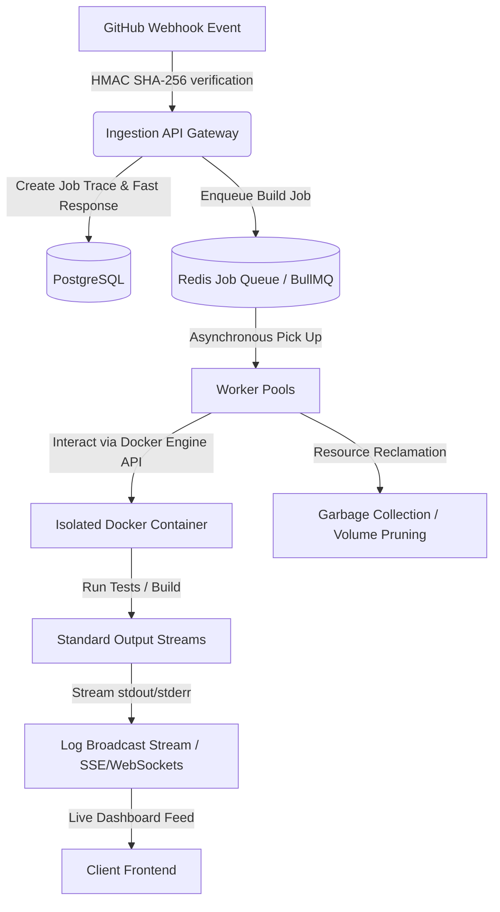

# Internship Project Architecture & 4-Week Milestone Plan

## Project Overview
The **Git-Triggered Headless CI/CD Automation Engine** is a high-performance, asynchronous infrastructure designed to simulate the core code orchestration pipelines of modern platforms like Vercel, Netlify, and GitHub Actions. This project validates advanced concepts in distributed systems, secure event-driven architectures, isolated container runtime execution, and real-time log multiplexing.

---

## 4-Week Architecture & Implementation Roadmap

### 📅 Week 1: Secure Ingestion Gateway & Relational Storage ✅
**Focus**: Ingestion API design, cryptographic verification, and job tracing state persistence.
- **Architectural Deliverables**:
  - `[x]` **Ingestion API Gateway**: Built using Node.js (Express) to expose a public HTTP POST endpoint.
  - `[x]` **Cryptographic Validator**: Real-time signature verification using HMAC SHA-256 matching GitHub's `X-Hub-Signature-256` payload header.
  - `[x]` **Relational Storage Model**: PostgreSQL schema to store job tracking information (`job_id`, `repo_url`, `commit_hash`, `status`, `logs_ref`, `timestamps`).
- **Key Tasks**:
  - `[x]` Setup gateway project and configure CORS, middleware.
  - `[x]` Implement route handling for GitHub webhook payloads.
  - `[x]` Implement cryptographic hash verification.
  - `[x]` Setup PostgreSQL connection pool.
  - `[x]` Ensure fast $O(1)$ gateway responses (yielding 202 Accepted status in under 30ms).

### 📅 Week 2: Distributed Job Queueing & Asynchronous Workers
**Focus**: Decoupling incoming webhook requests from heavy execution tasks.
- **Architectural Deliverables**:
  - **Job Broker (Redis)**: High-speed, in-memory message broker.
  - **Queue Processor (BullMQ / Celery / custom)**: Implements asynchronous queue patterns.
  - **Asynchronous Worker Shell**: Background service listening for new tasks and managing state transitions.
- **Key Tasks**:
  - Deploy Redis container instance on local developer host.
  - Setup BullMQ job producers inside the API Gateway.
  - Implement background worker pools that asynchronously pull code-execution tasks.
  - Create robust state machine handlers tracking transitions: `PENDING` ➔ `RUNNING` ➔ `SUCCESS` / `FAILED`.
  - Handle task retries, worker crash recoveries, and dead-letter queues (DLQ).

### 📅 Week 3: Docker-Engine Code Lifecycle Execution
**Focus**: Programmatic container orchestration, isolated sandboxing, and code checkout.
- **Architectural Deliverables**:
  - **Docker API Engine Integration**: Interfacing with host machine's `/var/run/docker.sock`.
  - **Ephemeral Execution Workspaces**: Dynamically creating isolated local directories to clone git repositories.
  - **Isolated Container Sandbox**: Spawning short-lived containers built for target execution runtimes (Node, Python, Go, etc.).
- **Key Tasks**:
  - Wire worker to use `dockerode` (Node.js) or Docker Go SDK to control Docker.
  - Implement Git clone functionality directly inside worker tasks (checkout target branch/commit).
  - Programmatically mount checked-out project paths as volumes inside isolated containers.
  - Trigger test execution commands dynamically (e.g., `npm install && npm test`) inside sandbox.
  - Handle container crash signals, execution timeout race constraints (e.g., max 5 minutes run limit).

### 📅 Week 4: Real-time Log Streaming & Resource Reclamation
**Focus**: Output multiplexing, WebSocket/SSE streaming, and container cleanup.
- **Architectural Deliverables**:
  - **Log Broadcast Stream (Socket.io / Server-Sent Events)**: Streaming real-time outputs from stdout/stderr.
  - **Log Aggregator**: Buffers and saves final build logs for persistence.
  - **Resource Reclamation Sweep**: Sweeper service to prevent zombie containers/volumes.
- **Key Tasks**:
  - Attach stream listeners to active container stdout and stderr outputs.
  - Stream chunks of logs in real-time over WebSocket connections/SSE to frontend.
  - Persist final execution output/logs to database or local storage system.
  - Build automated garbage collection routines using `AutoRemove=true` and manual sweep sequences to remove old build volumes and dead containers.
  - Connect UI dashboard to demonstrate live log streams and system-level metrics.

---

## 🛡️ Interview Defense & Mitigation Checklist

*   **Ingestion Starvation**: Mitigated by offloading workload immediately to Redis and returning an instant `202 Accepted` status.
*   **Zombie Container Leakage**: Solved by setting `AutoRemove=true` during container initialization and using timeout race conditions paired with tag-based startup cleanup sweep scripts.
*   **Log Overflow / Backpressure**: Handled by chunking log feeds and utilizing standard output streaming buffers instead of blocking memory storage.
