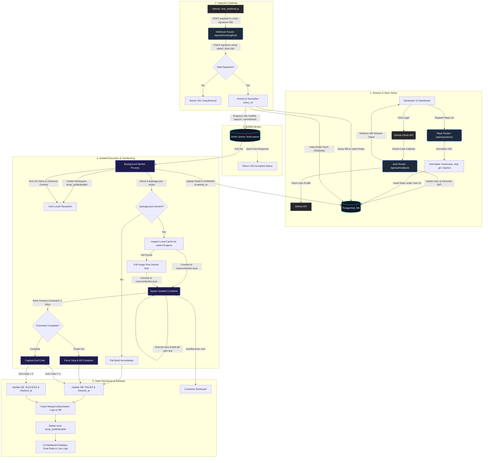

# Comprehensive System Flowchart: Weeks 1 - 3

This report contains a detailed architectural flowchart mapping the end-to-end flow of actions within the CI/CD Engine, including User Authentication, Repository Registration, Webhook Ingestion, Queueing, Docker Sandboxed Execution, and database tracking.

---

## 📊 End-to-End System Flowchart

The following flowchart maps out every operation, from the user logging in to the worker executing container tests and performing resource reclamation.

---

## 🔄 Detailed Breakdown of Flows

### 1. Ingestion Gate Response ($O(1)$ Complexity)
Note that **Job Queueing** runs concurrently with the Gateway response. The gateway pushes the build payload to the **Redis Queue** and immediately triggers `Return 202 Accepted Status` back to GitHub (or `test_webhook.js`) in under 30 milliseconds. The heavy sandboxed worker process only begins executing *after* the gateway has closed the HTTP connection, preventing connection timeouts.

### 2. Sandbox Filesystem Binding (Volume Isolation)
During container execution, the directory `temp_builds/${buildId}` on your local Mac serves as a physical host path. It is bind-mounted directly into `/app` inside the Alpine Node container. When processes inside the container write files (like logging dependencies or creating lockfiles), they write directly to this host directory.

### 3. Cleanup Cascade (Resource Reclamation)
As shown in **State Resolution**, cleanup is a two-step process:
1.  **Container Cleanup**: Handled natively by Docker daemon because the worker sets `AutoRemove: true`. The container removes its execution layers automatically on exit.
2.  **Filesystem Cleanup**: Handled by the worker's `finally` block which calls `workspace.js` to recursively run `fs.rm` on the host workspace directory, preventing disk bloat.
