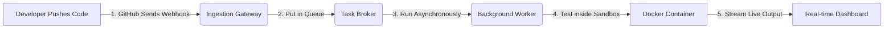

# Git-Triggered Headless CI/CD Automation Engine: Simplified Big Picture

## What is this project?
Think of this project as building your own mini **Vercel, Netlify, or GitHub Actions**. 

In the modern software world, when a developer updates their code and pushes it to GitHub, they don't manually run tests or build the project on their local computer. Instead, a server automatically notices the change, grabs the updated code, runs all the test suites inside a secure sandbox to verify nothing is broken, and displays live build logs to the developer.

This project is that exact **automation engine** running behind the scenes.

---

## The Big Picture Workflow

Here is exactly what happens step-by-step in plain English:

1. **The Code Push (GitHub Trigger)**: A developer pushes their code changes to a GitHub repository. GitHub instantly sends an alert (a "Webhook") to our **Ingestion Gateway**.
2. **The Waiting Line (Job Queue)**: The gateway quickly checks that the alert is authentic and says, *"Got it!"* (so GitHub doesn't have to wait). It puts the build job in a waiting line (the **Task Queue**) so other jobs can be processed in order.
3. **The Worker Bee (Runner)**: A background program (the **Worker**) notices a new job is waiting. It picks up the job, downloads (clones) the developer's code from GitHub, and prepares to run it.
4. **The Sandbox (Docker Container)**: To prevent malicious code from hacking our main server, the worker runs the developer's tests inside a sealed virtual sandbox (a **Docker Container**). If the tests pass, the build succeeds; if they fail, the build is marked as failed.
5. **Real-time Feedback (Log Streaming)**: While the code is building and running tests inside the sandbox, the terminal logs are streamed live back to the developer's web browser so they can watch progress in real-time.

---

## Why does this project matter? (The Resume Value)
Building a system like this proves you understand how modern, large-scale cloud infrastructure works:
*   **Decoupled Architecture**: The frontend, backend gateway, and worker processes run independently. If one crashes, the others keep working.
*   **Security & Isolation**: Code from external users is run inside isolated containers, protecting the host system from system-level vulnerabilities.
*   **Asynchronous Processing**: Using a queue ensures the website never lags or times out when hundreds of developers push code at the same time.
