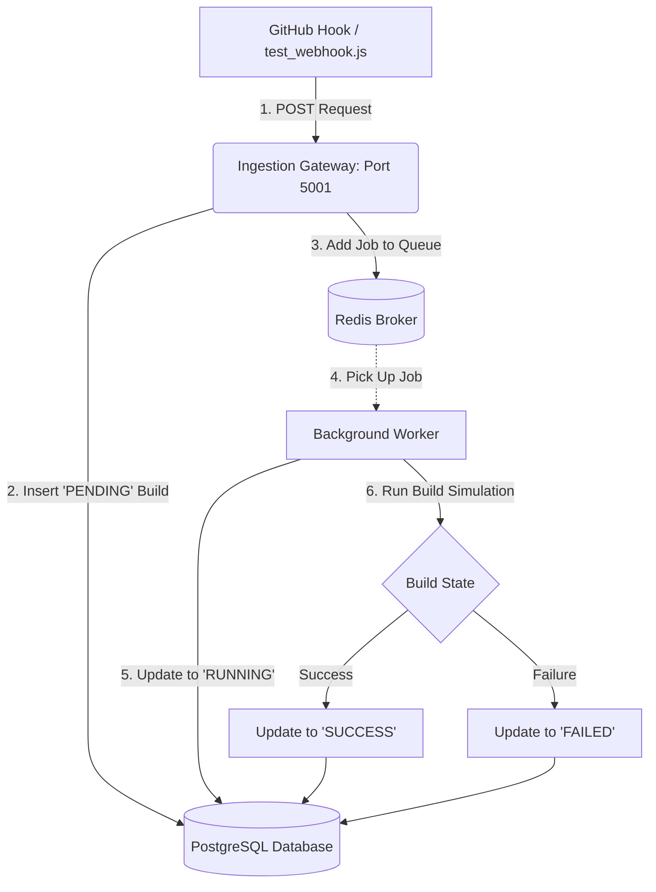

# Week 2 Implementation Plan: Asynchronous Queues & Background Workers

This report outlines the step-by-step design and implementation details for **Week 2** of the Git-Triggered Headless CI/CD Automation Engine.

---

## 🏗️ Architecture Design

To handle builds asynchronously without blocking the API gateway, we introduce **Redis** and **BullMQ** to orchestrate our task lifecycle.



---

## 🛠️ Step-by-Step Task Checklist

### 1. Redis Broker Deployment
We need a Redis database running locally to act as our message broker. 
*   **Command to verify/start local Redis**:
    ```bash
    redis-cli ping
    ```
*   *(If not running, you can run a Docker container for Redis)*:
    ```bash
    docker run -d --name magnus-redis -p 6379:6379 redis:alpine
    ```

### 2. Configure Environment Variables
Add Redis connection parameters to the bottom of your `backend/.env` file:
```env
REDIS_HOST=127.0.0.1
REDIS_PORT=6379
```

### 3. Initialize the Queue (`backend/src/queue.js`)
We will create a helper file to instantiate the BullMQ queue:
*   Import `Queue` from `bullmq`.
*   Establish connection details pointing to your `.env` configuration.
*   Export the queue object so the Webhook Ingestion Router can push jobs to it.

### 4. Update the Webhook Handler (`backend/src/routes/webhooks.js`)
*   Import the initialized queue.
*   Once a build is written to PostgreSQL (generating a `buildId`), add a job to the queue:
    ```javascript
    await buildQueue.add("run-build", {
      buildId: buildId,
      repoUrl: normalizedUrl,
      commitHash: commitHash
    });
    ```

### 5. Create the Worker Process (`backend/src/worker.js`)
We need a separate runner process that watches the Redis queue and processes jobs:
*   Import `Worker` from `bullmq`.
*   Connect to Redis.
*   Implement the job executor function:
    1.  **On Pick-up**: Update the build's status in PostgreSQL to `RUNNING` and record `started_at` timestamp.
    2.  **Simulation Execution**: Introduce a 10-second timeout delay (simulating a build and test sequence).
    3.  **On Completion**: Randomly set status to `SUCCESS` or `FAILED` to test both code paths, and update PostgreSQL with the final status and `finished_at` timestamp.

---

## 🧪 Verification & Testing Plan

1.  Start the backend server (`npm run dev`).
2.  Start the background worker in a separate terminal:
    ```bash
    node backend/src/worker.js
    ```
3.  Trigger a build using your mock test script:
    ```bash
    node backend/src/test_webhook.js
    ```
4.  Observe your **React Frontend Dashboard**:
    *   The build status will transition from **PENDING** ➔ **RUNNING** (animating/pulsing) ➔ **SUCCESS** / **FAILED** automatically without reloading the page!
